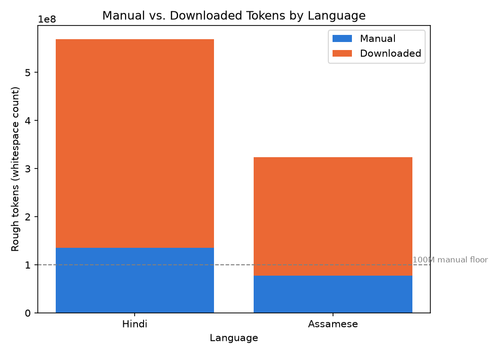
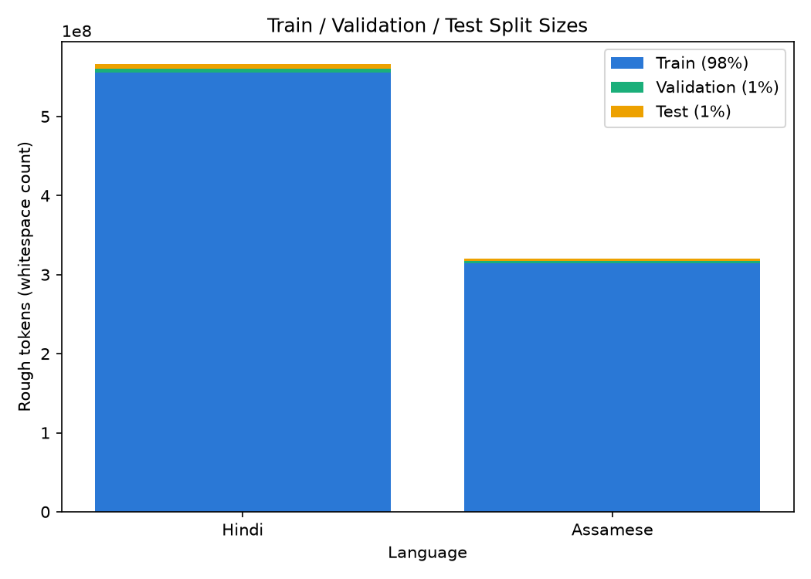
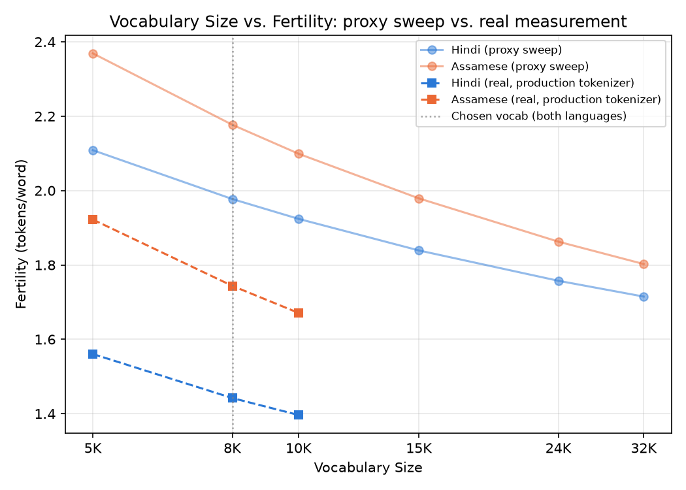

# Phase 1: Dataset and Tokenizer Statistics

Covers both models built for this project: Model H (Hindi, higher-resource) and Model L (Assamese, lower-resource, from the assignment's allowed list).

## Language selection

**Model H: Hindi.** Chosen as the higher-resource language for its abundant public corpora (over 12B verified tokens available in `ai4bharat/sangraha` alone) and mature NLP tooling (established news sites with clean sitemaps, Wikipedia dump extraction pipelines), making the ~500M-token target comfortably reachable within Phase 1's timeline.

**Model L: Assamese.** Chosen from the allowed lower-resource list. Motivated by two things: real digital text availability (several active Assamese news sites, a functioning Wikipedia, an online dictionary) that a self-scrape pipeline could realistically reach, and the specific challenge of hitting the manual-collection floor for a genuinely lower-resource language, as the assignment intends.

## Corpus overview

| | Hindi | Assamese |
|---|---|---|
| Total tokens (rough, whitespace) | 566,315,453 | 324,063,401 |
| Manual tokens (rough) | 135,301,892 | 78,037,234 |
| Downloaded tokens (rough) | 431,013,561 | 246,026,167 |
| Manual fraction | 23.9% | 24.1% |
| Vocabulary size | 8,000 | 8,000 |
| Fertility (real, tokens/word) | 1.4420 | 1.7437 |
| UNK rate | 0.0 | 0.0 |
| Total tokens (real, after tokenization) | ~816,626,883 | ~565,069,352 |
| Manual tokens (real, after tokenization) | ~195,105,328 | ~136,073,525 |
| Manual floor (100M) | Met | Met |
| Total target (500M) | Met | Met |



Both languages clear the ≥20% manual-collection requirement and the ~500M total-token target, measured on the real trained tokenizer's actual output, not a rough proxy.

## Sources

Full per-source detail (site, status, item counts, notes on what was checked and ruled out) lives in `hindi/data/SOURCES.md` and `assamese/data/SOURCES.md`, folded into the combined view in this file's sibling, `report/SOURCES.md`. Summary:

**Hindi:** NCERT textbook OCR, Digital Library of India book archive, Hindi Wikipedia (dump), Vikaspedia, and four news sites (abplive, indiatv — both fully drained; patrika, zeenews — still active before the corpus freeze) for manual collection; `ai4bharat/sangraha` (verified + unverified) for downloaded.

**Assamese:** SCERT/NCERT textbook OCR, Assamese Wikipedia/Wikisource/Wikiquote (dumps), xobdo.org dictionary, Vikaspedia, Digital Library of India book archive, government gazette and press-release archives, a broader archive.org Assamese-language query, YouTube auto-generated captions (three podcast/documentary channels), and eight news/literary sites (niyomiyabarta, asomiyapratidin, sentinelassam, dy365, news18, dainandinbartagroup, nenow, saneki) for manual collection; `ai4bharat/sangraha`, `MWirelabs/assamese-monolingual-corpus`, CC-100, and `ai4bharat/IndicCorpV2` for downloaded.

## Cleaning steps (both languages)

1. **Unicode normalization** (NFC) on all extracted text.
2. **Script-purity filter**: any line whose alphabetic characters aren't majority in-script (Devanagari for Hindi, Bengali-Assamese block for Assamese) is dropped; embedded non-target-script words are stripped at the word level from lines that otherwise pass (digits are kept, per course guidance).
3. **Assamese-specific**: a ৰ/ৱ frequency heuristic flags text that is in-script but likely Bengali rather than Assamese (the two languages share almost the entire Unicode block) — Bengali lacks these two letters entirely, Assamese uses them constantly.
4. **Exact-duplicate removal**: blake2b hash of the cleaned text, dropped on exact match, across all sources for a given language.

## Train / validation / test splits

Document-level (each surviving cleaned segment — one article, OCR page, dictionary entry, etc. — is one document), assigned by hashing the segment's own content mod 100: **~98% train / 1% validation / 1% test**. This is standard practice for LM pretraining corpora at this scale (see nanoGPT's ~99.95/0.05 split on OpenWebText), not the 80/10/10 convention from smaller classification datasets — a held-out set of a few million tokens is already enough for a statistically stable loss estimate, and every held-out token is one that manual collection worked to gather. The hash-based assignment is fully deterministic and reproducible from the corpus alone (no separate random seed to track), and happens after deduplication so no near-duplicate content leaks across splits.



| | Hindi train | Hindi val | Hindi test | Assamese train | Assamese val | Assamese test |
|---|---|---|---|---|---|---|
| Documents | 1,289,481 | 13,159 | 13,100 | 3,715,877 | 37,812 | 38,090 |
| Tokens (rough) | 555,124,385 | 5,453,827 | 5,737,241 | 317,626,304 | 3,280,364 | 3,156,733 |
| Share | 98.02% | 0.96% | 1.01% | 98.01% | 1.01% | 0.97% |

## Tokenizer

Both tokenizers are byte-level BPE trained with `sentencepiece`, per course guidance to use a library rather than a hand-rolled implementation, layered with this project's own decisions (see `<lang>/tokenizer/train_tokenizer.py` for the full rationale):
- `byte_fallback=True` + `character_coverage=0.9995` — no hard UNKs ever; rare/noise characters fall back to UTF-8 bytes instead of demanding a dedicated vocab slot (`character_coverage=1.0` was tried first and failed outright: the real corpus's character alphabet, 5,828 unique characters for Assamese, is far noisier than a small proxy sample suggested, and exceeded the 5,000-vocab budget before any subword merging could even start).
- Trained on the real final train split using `input_sentence_size=5,000,000` with `shuffle_input_sentence=True` — sentencepiece's own recommended way to bound training cost on a large corpus, sampling from the full split rather than a hand-built sample file.

### Vocabulary size choice

Vocab sizes were chosen via the course's own prescribed method — fertility on held-out text — measured across 5K–32K for both languages on a proxy sample first:



**Hindi: 8,000.** The proxy curve makes its single largest jump between 5K and 8K (2.109→1.977), then flattens; going further buys little (8K→10K only saves 0.05) while costing real embedding-table budget out of the fixed ~25M-parameter model.

**Assamese: 8,000, revised from an initial 5,000.** The proxy sweep initially favored 5,000 for Assamese — its curve never really flattens through 24K the way Hindi's does, and the corpus's own scarcity/duplication risk argued for preserving parameter budget for depth over embedding. But once the real 5,000-vocab tokenizer was trained and measured on the real corpus, real fertility (1.9220) came in notably better than the proxy estimate (2.369) had suggested. That same real-vs-proxy gap was checked at 8,000 too: real fertility 1.7437 (vs. a 2.177 proxy estimate), and the real threshold impact at 8K stays comfortably clear (manual ~136.1M/100M = 136.1%, total ~565.1M/500M = 113.0% — see the overview table above). With no severe real-measured cost at 8K, Assamese was matched to Hindi's vocab size rather than kept smaller on the strength of a proxy-sample argument alone. The embedding-vs-depth-budget tradeoff (below) and the general scaling-law data-scarcity argument (Tao et al., "Scaling Laws with Vocabulary," arXiv 2407.13623) still exist as considerations, but they're theoretical until Phase 2 training actually measures downstream model quality — they weren't strong enough on their own to prefer a smaller vocab once the real fertility numbers ruled out a severe token-count cost.

A source-tracking bug was found and fixed the same day the vocab was finalized: three real, already-collected, already-cleaned manual sources (a broader archive.org Assamese-language query, the `news18` scrape, and YouTube auto-generated captions — about 3.67M rough words combined, ~1.1% of the corpus) were missing from the counting/split-building script's source list and so were silently excluded from every reported number and from the train/val/test split itself, despite sitting correctly collected on disk. Fixed by adding them to the source list and rebuilding the splits and all counts; the tokenizer itself was not retrained since fertility barely moved (1.7417 -> 1.7437) with the fix. All numbers in this report reflect the corrected, complete corpus.

At d_model=384 (illustrative; final architecture is a Phase 2 decision), an 8K-vocab embedding table costs 12.3% of a 25M-parameter budget for either language — leaving the large majority of the budget for actual transformer depth.

### Token-frequency statistics

| | Hindi (vocab 8,000) | Assamese (vocab 8,000) |
|---|---|---|
| Fertility | 1.4420 tokens/word | 1.7437 tokens/word |
| UNK rate | 0.0 | 0.0 |
| Avg chars/token (vocab pieces) | 4.075 | 4.325 |
| Avg chars/token (real corpus encoding) | 3.5869 | 3.6890 |
| Top frequent pieces (excluding special tokens) | `▁क ▁स ▁ह ▁म ▁प ्र ें ार ▁है ▁के` | `▁ক য় াৰ ▁ব ▁প ▁স ▁আ ্ৰ ▁ম ্য` |

"Real corpus encoding" is measured as total raw character count (including spaces) of the held-out val split, divided by the number of BPE tokens the production tokenizer produces encoding it. Hindi's figure was corrected during a later audit pass: the previously reported 3.276 could not be reproduced with this method and was stale from an earlier, unverified measurement; 3.5869 is the current, reproducible value on the same val split used for its fertility measurement.

### Tokenization examples

**Hindi** (`अध्याय 10 गतिविधि 1 — स्वयं से`):
```
▁अध्याय ▁10 ▁गतिविधि ▁1 <0xE2> <0x80> <0x94> ▁स्‍ व यं ▁से
```
(the em dash falls outside the 0.9995 character-coverage band and correctly falls back to UTF-8 bytes rather than an UNK)

**Assamese** (`উত্তৰ-পূব ভাৰতৰ অসমৰ সংগীতসমূহ হ'ল মূলতঃ থলুৱা লোক সংগীত আৰু`):
```
▁উত্তৰ - পূব ▁ভাৰতৰ ▁অসমৰ ▁সংগীত সমূহ ▁হ ’ ল ▁মূলতঃ ▁থলুৱা ▁লোক ▁সংগীত ▁আৰু
```
(the 8K vocab has a dedicated piece for `মূলতঃ`/`থলুৱা` where the 5K vocab split them further — a direct, visible instance of the fertility improvement)

## Known limitations, documented not hidden

- The ৰ/ৱ Bengali-vs-Assamese heuristic is a frequency signal, not a calibrated language-ID classifier — flagged in `token_progress.md` as a known limitation, not claimed as ground truth.
- A handful of early Assamese OCR/scrape batches (before a mid-session fix) only have cleaned text saved, not true raw text — documented in `assamese/data/SOURCES.md`, not reconstructed.
- Manual-collection sources vary in tier: live-scraped news and dictionary sites are the strongest signal; YouTube auto-generated captions (three Assamese podcast channels) are machine transcription, not human transcription — a real but different tier, described accurately rather than presented as equivalent to hand-scraped text.
