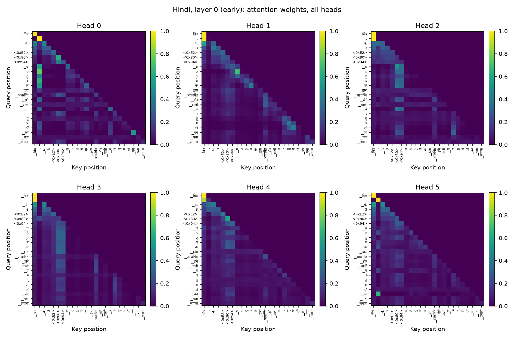
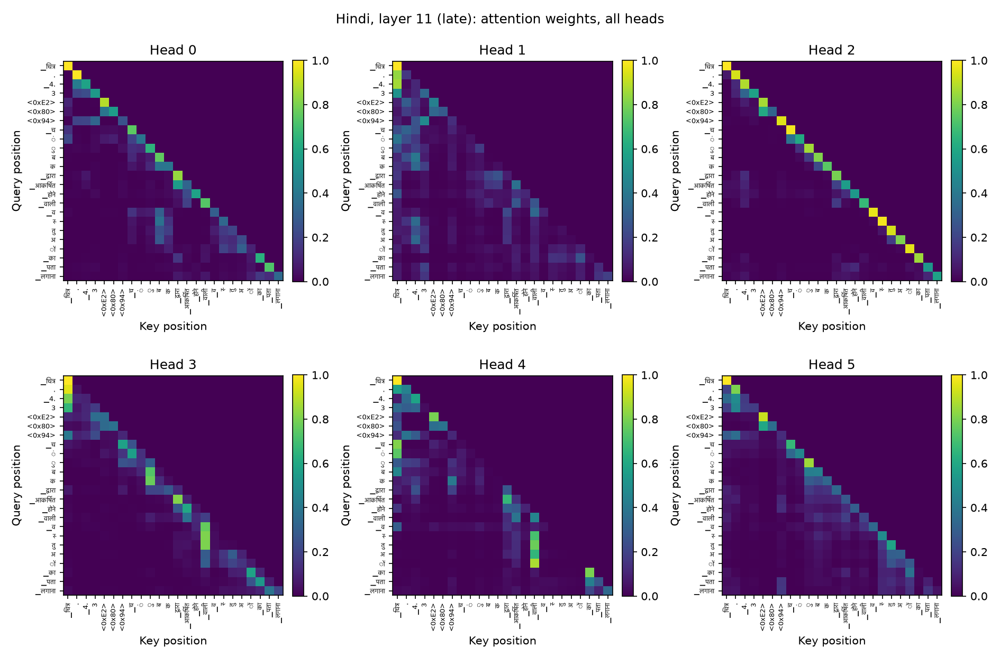
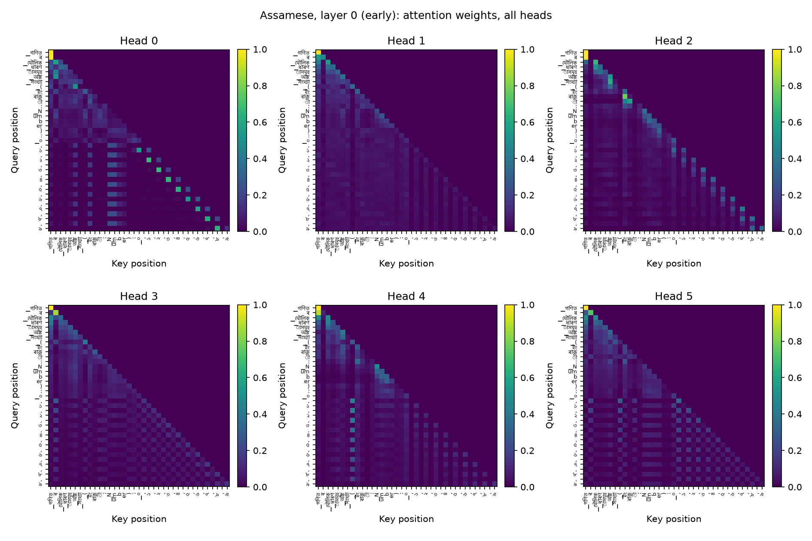
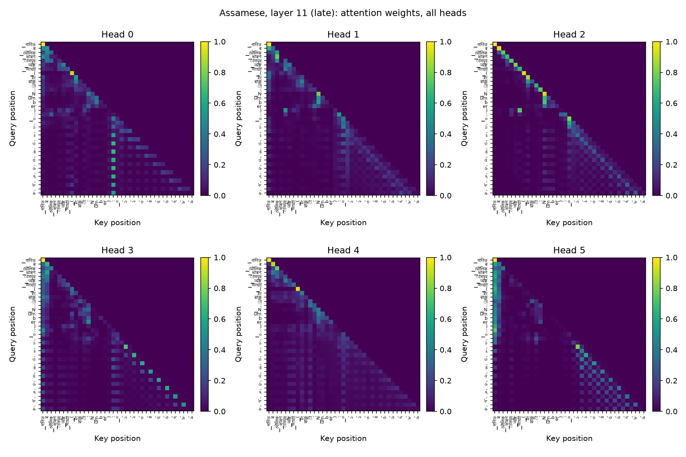

# Phase 2: Attention Analysis

Computed on real held-out sentences from each language's test split (not
hand-crafted, decided 2026-08-31), using `model.py`'s
`return_attention` flag (additive, verified to leave logits and existing
checkpoint compatibility unchanged, see `report/phase2_architecture.md`).
4 example sentences per language, 10 to 40 tokens each, short enough for
a legible query-vs-key heatmap. Both models have 12 layers and 6 heads;
layer 0 is treated as early, layer 11 as late.

## Heatmaps

Query positions on the rows, key positions on the columns, color scale is
attention weight, tick labels are the real tokenizer pieces for that
example sentence (a `<0xNN>` label is a byte-fallback piece, one raw
UTF-8 byte, not a vocabulary subword). In Hindi's late layer, head 2
shows a clean diagonal, each query attends almost entirely to itself or
the immediately preceding token, a local/positional head. Head 4 in the
same layer shows the opposite: sparse, longer-range spikes back toward
an earlier content word rather than the diagonal, a content-based head.
Both patterns are visible within a single layer, not separated cleanly
by depth.

## Entropy per layer (averaged over heads and example sentences)

| Layer | Hindi | Assamese |
|---|---|---|
| 0 | 1.90 | 2.08 |
| 1 | 1.78 | 1.91 |
| 2 | 1.19 | 1.43 |
| 3 | 1.68 | 1.88 |
| 4 | 1.32 | 1.78 |
| 5 | 1.15 | 2.00 |
| 6 | 1.00 | 1.88 |
| 7 | 1.34 | 1.76 |
| 8 | 1.31 | 1.80 |
| 9 | 1.40 | 1.63 |
| 10 | 1.44 | 1.68 |
| 11 | 1.37 | 1.65 |

## Mean attention distance per layer (averaged over heads and example sentences)

| Layer | Hindi | Assamese |
|---|---|---|
| 0 | 4.94 | 5.67 |
| 1 | 4.63 | 5.63 |
| 2 | 2.71 | 3.05 |
| 3 | 4.40 | 4.96 |
| 4 | 3.65 | 4.61 |
| 5 | 6.60 | 5.32 |
| 6 | 7.66 | 5.35 |
| 7 | 5.96 | 5.26 |
| 8 | 6.64 | 6.12 |
| 9 | 6.80 | 4.65 |
| 10 | 6.95 | 6.84 |
| 11 | 3.05 | 5.68 |

## Discussion

**Neither model follows a clean "early layers local, late layers
long-range" story**, the pattern that a naive early/mid/late narrative
would predict. Both show a sharp dip in entropy and mean attention
distance specifically at layer 2 (Hindi entropy 1.19, distance 2.71;
Assamese entropy 1.43, distance 3.05), the most locally concentrated
layer in either model, despite the two models never sharing data,
vocabulary, or weights. This is a real shared structural feature, not an
artifact of one corpus, and reads as an early stage doing something like
local n-gram or immediate-context processing before longer-range
attention develops in the layers that follow.

Long-range attention (higher mean distance) is concentrated in the
middle-to-late layers for both models (Hindi layers 5-10, distance
5.96-7.66; Assamese layers 4-10, a flatter 4.61-6.84), not the very last
layer. Hindi's final layer (11) drops sharply back to local (distance
3.05, close to layer 2's minimum), while Assamese's final layer stays
comparatively long-range (5.68). This is a genuine difference between the
two models rather than a shared pattern: Hindi appears to consolidate
back to local, next-token-relevant attention immediately before the
output head, while Assamese does not show the same sharp late-layer
contraction. Given the two models differ in real training corpus size
(834M vs 565M tokens) and share nothing else that could produce a
resource-tier-linked difference, this is worth flagging as an observed
gap rather than explained with confidence from attention statistics
alone.

Assamese's attention is more diffuse than Hindi's throughout (higher
entropy at 10 of 12 layers, generally higher mean distance in the early
and middle layers), consistent with the smaller real training corpus:
less data gives the model less signal to commit to sharp, confident
attention patterns, the same direction as its higher perplexity
(`report/phase2_lm_eval.md`) and lower generation-quality metrics
(`report/phase2_generation_eval.md`).
