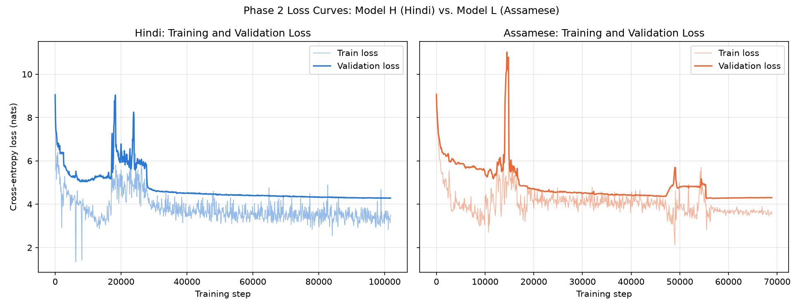

# Phase 2: Language Modeling Evaluation (PPL / BPB)

## Loss curves

Both languages show the same pattern: a fast initial drop, then one or
more sharp, temporary spikes in both train and validation loss (hindi
around step 18,000 to 27,000; assamese around step 14,500 and again near
47,000 to 55,000), followed by a return to steady improvement. These
spikes line up with the unshuffled, source-ordered concatenation used to
build each train split (ocr, scrape, vikaspedia, dli_books, sangraha in
that fixed order): different step ranges are drawn from different source
domains rather than an i.i.d. sample, so a transition between sources
shows up as a visible bump. This is a known, already-documented limitation
of the corpus pipeline, not a training bug; single-epoch training bounds
the damage, and both curves recover and continue improving afterward.

Intrinsic language-modeling metrics for Model H (Hindi) and Model L
(Assamese), per spec section 2.3. Evaluated on the full validation and
test splits (no sampling), forward-only, no gradients. PPL = e^CrossEntropyLoss.
BPB (bits-per-byte) converts the per-token cross-entropy from nats to bits
and divides by the raw UTF-8 byte length of the held-out text, making the
two languages comparable despite their different tokenizers and fertility
(Hindi 1.4940 tokens/word, Assamese 1.7780 tokens/word).

## Results

| Model | Split | Cross-entropy (nats) | Perplexity | BPB | Tokens evaluated |
|---|---|---|---|---|---|
| Hindi (Model H) | val | 3.6592 | 38.83 | 0.5981 | 8,359,424 |
| Hindi (Model H) | test | 3.6496 | 38.46 | 0.5952 | 8,633,600 |
| Assamese (Model L) | val | 3.9653 | 52.73 | 0.5934 | 5,633,792 |
| Assamese (Model L) | test | 3.9829 | 53.67 | 0.5990 | 5,861,120 |

Hindi checkpoint: step 101,812 (one full epoch over the ~834M-token train
split, batch_size=32, peak_lr=6e-4). Assamese checkpoint: step 69,000
(one full epoch over the ~565M-token train split, batch_size=32,
peak_lr=3e-4).

## Notes

Val and test scores are nearly identical for Hindi (loss 3.6592 vs 3.6496),
no sign of the val split being systematically easier or harder than test.

The training loop's own in-progress validation diagnostic (a 5-batch,
40,960-token sample checked periodically during training, purely for
monitoring) had suggested a noticeably larger train/val gap than this full
val-set measurement shows. The full-split number here is the reliable one
for reporting; the in-loop diagnostic was a cheap, noisy proxy only. The
same holds for Assamese: the in-loop diagnostic suggested a smoothed
train/val gap of about 0.66 nats late in training, while the full test
set here shows a real cross-entropy of 3.9829, much closer to the
smoothed train-side estimate of about 3.82.

Perplexity and BPB tell different stories about the gap between the two
models, and the difference is informative rather than contradictory.
Assamese's test perplexity (53.67) is about 40 percent higher than
Hindi's (38.46), consistent with Assamese having a smaller real training
corpus (about 565M tokens against Hindi's 834M). Bits per byte, however,
is nearly identical between the two languages (Hindi 0.5952, Assamese
0.5990 on test), and Assamese's validation BPB (0.5934) is marginally
lower than Hindi's (0.5981). Perplexity is measured per token, and
Assamese's tokenizer needs more tokens to cover the same text (fertility
1.7780 against Hindi's 1.4940), so a portion of Assamese's higher
perplexity reflects the tokenizer producing more, smaller units to
predict rather than the model being less capable per unit of actual text.
BPB corrects for this by measuring against raw bytes instead of tokens.
This does not mean the two models are equivalent: less training data for
Assamese is a real, separate constraint, but the size of the gap looks
different depending on which metric is read, and attributing it correctly
requires reading both together rather than either alone.

## Tokenizer sampling (alpha)

Both tokenizers use deterministic BPE encoding, no subword regularization.
For a BPE model, SentencePiece's alpha parameter is the per-merge dropout
probability used by BPE-dropout (Provilkov et al., 2019): at alpha = 0, no
merge is ever skipped, which is standard deterministic BPE. Our encode
calls never set enable_sampling, so this project's value is alpha = 0 for
both languages.

Subword regularization was not applied because both models train for a
single epoch over a pre-tokenized, fixed corpus. Its benefit comes from
exposing a model to different segmentations of the same text across
repeated passes, which does not happen here: each token is seen exactly
once regardless of which segmentation produced it.

## Decontamination

Deduplication in both languages is exact hash matching only (blake2b on
cleaned text), applied once across the whole corpus before train, val,
and test are split apart. Because of this ordering, an exact duplicate
cannot appear in two different splits: whichever copy is seen first is
kept and assigned to one split, every later copy is dropped outright, so
exact duplicate leakage across train, val, and test is ruled out by
construction, not by a separate check.

Near duplicates are a different matter and are not detected. Two segments
that carry the same underlying content but differ at the character level
(a reformatted article, a second OCR pass, the same passage picked up by
more than one source such as Sangraha and an independent scrape) hash
differently and are treated as unrelated text. Such a pair could in
principle land in different splits, so perplexity and BPB on the held out
sets may be mildly optimistic if any such pairs exist. The scale of this
effect has not been measured.

This was evaluated against the actual project spec rather than assumed.
Phase 1 requires only that duplicate data be removed, with no ordering or
near duplicate requirement. Phase 2's evaluation section has no leakage
requirement at all. Phase 3 does require avoiding train test leakage, but
for the synthetic reasoning finetuning dataset, a separate, generated
corpus that is not affected by this limitation. Building near duplicate
detection for the pretraining corpus, then rebuilding the splits and
retraining both models, was estimated at roughly eighteen to twenty four
hours of machine time. That cost was judged better spent on evaluation
work the spec does require and that had not yet been built, so this
limitation was documented rather than fixed.
